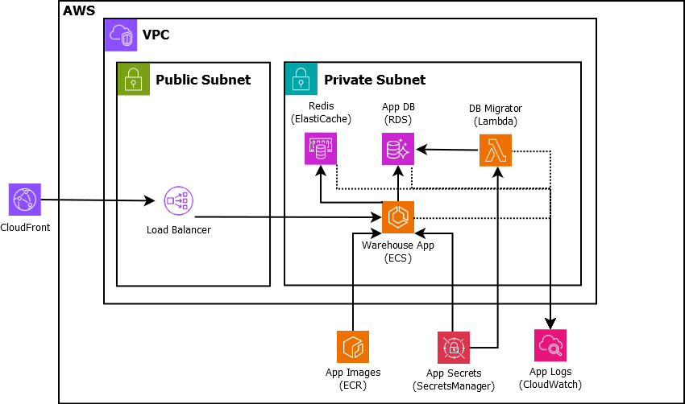

# Warehouse API (boilerplate)   

> REST API over ASP.NET Core running on AWS infra 

## Architecture

## Stack
- FW: ASP.NET Core, .NET 9
- DB: MySQL
- ORM: [ServiceStack ORMLite](https://docs.servicestack.net/ormlite/)
- Migration [DBUp](https://dbup.github.io/)
- Logging: [Serilog](https://serilog.net/)
- Mapping: [AutoMapper](https://automapper.org/)
- API explorer: [Swashbuckle/Swagger](https://github.com/domaindrivendev/Swashbuckle.AspNetCore/)
- Infra: [AWS](https://aws.amazon.com/), [LocalStack](https://www.localstack.cloud/)
- Test FW: [NUnit](https://nunit.org/)

## Authentication
The API uses stateless authentication (bearer token in session cookie)

